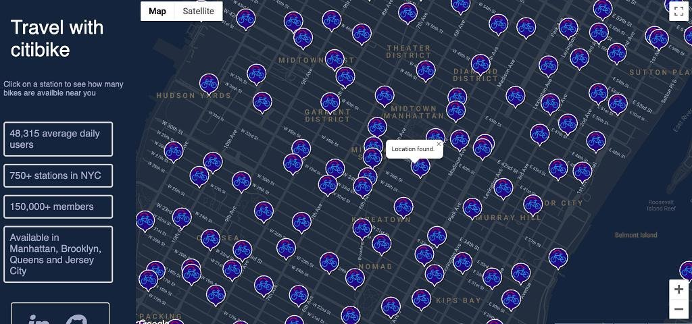

# Citibike NYC Data Visualization

## Live site: ​https://kdegnan1.github.io/Citibike/

### Background and Overview
* Motivation for project
    * This data visualization will show the locations of bike stations and available bikes in the NYC Area in live time.  
* Citibike live bike station API:  https://citibikenyc.com/stations/json'
    
### Functionality and MVP Features
* Create a map of the NYC Area
* Use Google Maps to mark each city bike station given by the API
* Get live data of bikes available at any station in the city. 
* Show all the Citibike stations in the NYC Area
* Use Google Maps Geolocation to allow user to give their location and show available bike stations near them 

### Architecture and Technologies 
* Technologies used: JavaScript, Google Maps API, CitiBike API, CSS, HTML
* Google Maps API 
    *  Leveraged the HTML5 geolocation feature along with Google Maps Javascript API to display the location of the user and surrounding bike stations.
        ```Javascript 
            if (navigator.geolocation) {
        navigator.geolocation.getCurrentPosition(function (position) {
            var pos = {
                lat: position.coords.latitude,
                lng: position.coords.longitude
            };

            infoWindow.setPosition(pos);
            infoWindow.setContent('Location found.');
            infoWindow.open(map);
            map.setCenter(pos);
        }, function () {
            handleLocationError(true, infoWindow, map.getCenter());
        });
         } else {
        
        handleLocationError(false, infoWindow, map.getCenter());
         }

        ```
        ```Javascript 
            function handleLocationError(browserHasGeolocation, infoWindow,pos){
                infoWindow.setPosition(pos);
                infoWindow.setContent(browserHasGeolocation ?
                    'Error: The Geolocation service failed.' :
                    'Error: Your browser doesn\'t support geolocation.');
                infoWindow.open(map);
            }   
        ```
    * * Integrated Google Maps API to render a map of the NYC area directly into the DOM and mark the locations of all CitiBike stations based on CitiBike API responses.
        ```Javascript 
                    window.addEventListener('DOMContentLoaded', () => {
            console.log('loaded')
            // initAutocomplete()
            makeRequest('GET', 'https://cors-anywhere.herokuapp.com/https://citibikenyc.com/stations/json')
            
                .then((datums) => {
            JSON.parse(datums)["stationBeanList"].forEach( bike => { 
                
                const contentString = `<div>${'Available Bikes:  '}</div><div>${bike['availableBikes']}</div>`

                    let icon = {
                        url: 'https://i.imgur.com/4dysiV6.png', 
                        scaledSize: new google.maps.Size(50, 50), // scaled size
                    };

                    let marker = new google.maps.Marker({
                        position: { lat: bike['latitude'], lng: bike['longitude'] },
                        // title: 'Available Bikes:  ' +  bike['availableBikes'].toString(), 
                        icon: icon, 
                        htmlContent: contentString
                    });
                

                    marker.addListener("click", function () {
                        infoWindow.setContent(marker.htmlContent)
                        infoWindow.open(map, marker);
                    });

                marker.setMap(map) 

                })}
            )}
        ); 
        ```
* Fetched and stored data asynchronously from the CitiBike API using XML requests to get live data of available bikes at any station in the NYC area
    ```Javascript 
        const makeRequest= (method, url) => {
    return new Promise(function (resolve, reject) {
        var xhr = new XMLHttpRequest();
        xhr.open(method, url);
        xhr.setRequestHeader('Accept', "*/*");
        xhr.onload = function () {
            if (this.status >= 200 && this.status < 300) {
                resolve(xhr.response);
            } else {
                reject({
                    status: this.status,
                    statusText: xhr.statusText
                });
            }
        };
        xhr.onerror = function () {
            reject({
                status: this.status,
                statusText: xhr.statusText
            });
        };
        xhr.send();
    });
}

    ```

        

        
        

